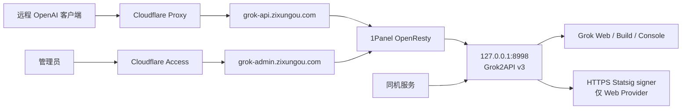

# Grok2API v3 线上私有网关设计

## 1. 目标

在现有 zixungou 生产服务器 `45.32.46.142` 上部署上游 Grok2API v3，供个人远程设备和同机服务使用。公网仅提供 OpenAI Chat Completions 兼容能力；账号、模型和客户端密钥通过独立的受保护管理域名维护。

本设计优先满足：

- 不影响现有 zixungou、CLIProxyAPI、PostgreSQL、Redis、Meilisearch 和监控服务。
- 不在公网直接暴露应用端口、账号凭据、管理 API 或未使用的推理能力。
- 不部署旧 Python 分支及其常驻 Chromium `statsig-signer`。
- 保留文本对话、流式响应、函数调用和 Grok 联网搜索。
- 可以按镜像与数据库快照成对回滚。

## 2. 已确认范围

### 2.1 公网推理接口

`grok-api.zixungou.com` 只允许：

- `GET /v1/models`
- `POST /v1/chat/completions`

`GET /healthz` 和 `GET /readyz` 仅供服务器本机健康检查，不从公网域名转发。

### 2.2 保留能力

- 纯文本消息。
- SSE 流式响应和非流式响应。
- OpenAI `tools`、`tool_choice` 和 `tool_calls`。
- Grok 服务端联网搜索与搜索来源。
- 多账号调度、额度同步、冷却、失败切换和客户端密钥管理。
- React Admin，用于账号、模型路由、客户端密钥和运行状态管理。

### 2.3 禁止或不部署的能力

- `/v1/responses` 及 stored response、compact。
- `/v1/messages`。
- 图片生成、图片编辑、视频生成和媒体读取。
- 请求中的图片、音频和文件附件。
- Swagger 公网文档。
- 旧版 WebUI、语音页面和 Masonry。
- FlareSolverr、WARP、Redis、PostgreSQL 和本地 Chromium signer；仅在独立评审后才可增加。

这些能力由三层共同收敛：OpenResty 路径白名单、应用模型路由状态、客户端密钥模型白名单。未使用代码即使存在于官方镜像中，也不能从公网入口到达。

## 3. 选型

采用上游 `chenyme/grok2api` v3 的官方单容器镜像，不迁移当前本地 Python 分支。设计审查基线为 2026-07-23 的 v3.0.7、提交 `0a761ff`；实施时只能选择该版本或经过相同测试矩阵验证的更新版本。

选择依据：

- v3 后端为 Go 单二进制，前端静态文件内置在镜像中，不含 Playwright 或 Chromium。
- 容器入口脚本以 `umask 077` 复制配置，并使用 `su-exec` 降权到 UID/GID 10001。
- v3 内置管理员 JWT、安全 Cookie、登录限流、凭据加密、客户端 Key 限流与模型权限。
- 单实例原生支持 SQLite 与内存运行态，适合当前 1 核、1.6 GiB 服务器。
- 继续跟随上游版本比维护大范围删减分支更可靠。

生产部署必须固定发布版本和镜像 digest，不使用可漂移的 `latest` 作为最终运行引用。升级时重新核对发行说明、镜像架构和数据库迁移，再更新固定 digest。

## 4. 生产拓扑

### 4.1 应用项目

- 项目目录：`/opt/1panel/apps/local/grok2api/`
- Compose 项目：独立于现有 zixungou 和 CLIProxyAPI 项目。
- 宿主机发布：`127.0.0.1:8998:8000`。
- 数据库：SQLite。
- 运行态：Memory。
- 持久化：独立 Docker volume，仅保存 Grok2API 数据。
- 配置：宿主机 `config.yaml` 以只读方式挂载。

### 4.2 两个域名的职责

`grok-api.zixungou.com`：

- 允许两个推理路径。
- 拒绝 Admin、前端、健康检查、Swagger、媒体和其余 `/v1/*`。
- 支持 SSE，关闭代理响应缓冲。
- 不启用 Cloudflare Access，使用应用客户端 API Key。

`grok-admin.zixungou.com`：

- 整个域名强制经过 Cloudflare Access。
- 允许 React Admin 静态资源和 `/api/admin/v1/*`。
- 拒绝 `/v1/*`、Swagger 和公网健康检查。
- Cloudflare Access 之后仍需应用管理员登录。

### 4.3 同机调用

同机服务直接调用 `http://127.0.0.1:8998`，但仍需各自独立的客户端 API Key。同机来源不绕过应用鉴权、模型权限、RPM 或并发限制。官方镜像内部仍注册其他协议路由；对可信同机服务的接口约束依靠调用规范和 Key 的模型权限，公网的硬性接口约束由 OpenResty 白名单保证。本设计不把恶意同机进程纳入威胁模型。

## 5. 安全设计

### 5.1 源站与反向代理

- DNS 使用 Cloudflare 代理模式。
- 复用服务器现有 `00-cloudflare-realip.conf` 和 `$cf_or_lan` 判定，拒绝非 Cloudflare、非回环、非私网来源直连业务虚拟主机。
- UFW 继续只开放既有端口；不为 Grok2API 新增公网端口。
- OpenResty 在转发前执行精确路径与 HTTP 方法白名单。
- API 域名不返回允许任意 Origin 的 CORS 头。
- OpenResty 与应用的请求体上限均设为 1 MiB。
- OpenResty 对 API 域名设置基础 IP 限流；应用继续按客户端 Key 执行 RPM、并发和计费上限。
- SSE 路由使用 HTTP/1.1、关闭代理缓冲并设置适合长推理的读超时。

### 5.2 Admin

- Cloudflare Access 仅允许指定管理员邮箱，拒绝其他身份。
- 应用设置 `auth.secureCookies: true`。
- Admin Access Token 有效期 15 分钟，Refresh Token 有效期 7 天。
- 首次启动使用随机强密码创建管理员；首次登录并修改密码后，从 `config.yaml` 删除 `bootstrapAdmin` 并重启验证。
- 生产设置 `server.swaggerEnabled: false`。
- Admin 是高权限入口，可以操作账号、模型、密钥和运行设置；Cloudflare Access 不能替代应用登录。

### 5.3 客户端密钥

- 每个同机服务、个人设备或客户端使用独立 Key，禁止共享一把长期主密钥。
- 普通服务初始限额：30 RPM、最大并发 2。
- 个人主客户端初始限额：60 RPM、最大并发 4。
- 每个 Key 只允许已确认的聊天模型路由。
- 不再使用的 Key 立即禁用并轮换；泄漏单个 Key 不应影响其他调用方。

### 5.4 凭据与配置

- `jwtSecret` 使用至少 32 字符的独立随机值。
- `credentialEncryptionKey` 使用独立的 32 字节 Base64 密钥。
- Admin 密码、客户端 API Key 和上游账号凭据互不复用。
- `config.yaml` 所有者为 root，权限 `0600`，不提交 Git、不写入文档和命令输出。
- `credentialEncryptionKey` 需要单独的加密备份；更换或丢失该密钥会导致已有上游凭据不可解密。
- 不把 Docker Socket、宿主机根目录或其他业务数据卷挂入容器。

### 5.5 容器隔离与资源

- `security_opt: no-new-privileges:true`。
- 在兼容性测试通过后启用 `cap_drop: [ALL]`。
- 设置 PID 上限，禁止 privileged 和 host 网络。
- 初始资源上限：0.75 CPU、384 MiB 内存；以 24 小时观测结果调整，不解除上限来掩盖泄漏。
- 唯一持久化写入位置是应用数据卷。
- 不运行本地 Chromium、FlareSolverr 或 WARP sidecar。

## 6. 数据保护与日志

### 6.1 数据敏感性

SQLite 数据库包含：

- 加密后的上游账号凭据。
- 管理员和客户端密钥记录。
- 模型、额度、路由和审计元数据。
- 失败请求的受限诊断快照。

上游 v3 的成功审计不保存提示词和模型响应正文；失败尝试可能保存最多 64 KiB 的上游响应体。因此数据库和备份始终按敏感数据处理。

### 6.2 日志规则

- 不记录 Authorization、Cookie、SSO Token、Admin 密码、客户端完整 Key、请求正文或成功响应正文。
- 账号或密钥只使用不可逆标识、前缀或掩码。
- 应用与 OpenResty 日志保留 7 天。
- 日志轮转、备份和故障排查不得将敏感字段输出到终端会话或 CI 日志。

### 6.3 备份

- 每日备份 `config.yaml` 和 SQLite 数据。
- 保留 7 个日备份与 4 个周备份。
- 备份文件加密保存，并与 `credentialEncryptionKey` 的独立备份一起纳入恢复流程。
- 每次应用升级前额外创建数据库快照。
- 定期在隔离目录验证备份可启动、管理员可登录和凭据可解密。

## 7. Statsig 与上游网络

### 7.1 初始方案

Grok Web Provider 初期使用上游默认 HTTPS signer。新版应用先从 Grok 页面提取 `grok-site-verification` 元数据，再向 signer 发送：

- HTTP 方法。
- Grok 目标路径。
- 页面验证 `metaContent`。

应用不会把 SSO Token 或 Cookie 直接放入 signer 请求。第三方 signer 仍能观察服务器出口 IP、调用路径、请求时间和验证元数据，因此它属于明确的外部信任依赖。

### 7.2 失败语义

- 签名按路径缓存，并允许使用已有的过期缓存作为短期故障兜底。
- signer 预热失败时 `/readyz` 将 Web Provider 标记为 degraded，请求仍可按需刷新。
- 持续失败时不自动启动 Chromium，也不无限重试。
- 如果 Build 或 Console 路由可提供所需聊天能力，临时停用 Web 路由并切换到可用 Provider。
- 手动 Statsig 只作为短期应急方案；自建 signer 必须单独设计鉴权、网络隔离、资源和升级流程。

### 7.3 Clearance

初始使用手动 Clearance 模式，不启动 FlareSolverr。如果 Web/Console 账号因 Cloudflare 持续失败，先核对出口 IP、Cookie 与 User-Agent 绑定，再单独评审 FlareSolverr；不能把 FlareSolverr 当作 Statsig signer。

## 8. 旧版账号迁移

- 不复制或挂载旧 Python 版 `data/accounts.db`。
- 从本地旧版安全导出 Web Token/凭据文件，通过新版 Admin 的 Web 账号导入功能上传。
- 导出文件不进入 Git、不上传到共享网盘、不写入命令参数或日志。
- 导入完成并确认新版凭据已加密保存后，清理临时导出文件。
- 等待账号状态、额度和模型能力首次同步完成后，才能启用对应聊天路由。

## 9. 上线流程

1. 记录现有容器、监听端口、OpenResty 配置、磁盘、内存和负载基线。
2. 仅清理已确认未使用的 Docker 构建缓存和旧镜像，将根盘使用率降至 75% 以下；不删除运行容器依赖的镜像或卷。
3. 创建独立项目目录、固定版本 Compose、配置文件和数据卷。
4. 只启动回环端口，验证 `/healthz`、`/readyz`、容器用户、挂载、资源限制和日志。
5. 配置并验证 Cloudflare Access，再开放 Admin 域名。
6. 完成管理员初始化、改密和 bootstrap 配置移除。
7. 通过 Admin 导入账号，等待同步，启用 Chat 模型路由。
8. 创建按调用方隔离的客户端 Key 和模型白名单。
9. 在回环地址完成文本、SSE、tools 和搜索测试。
10. 创建两个 OpenResty 站点配置；语法检查成功后 reload。
11. 执行公网路径、鉴权、源站绕过、限流和泄密测试。
12. 连续观察至少 24 小时后完成上线验收。

## 10. 错误处理

- 无可用账号：返回明确的 429 或 503，不无限换号重放。
- 单账号 401/403/429：更新账号健康、冷却或重新认证状态，日志不含凭据。
- signer 故障：标记 degraded，使用缓存或按需刷新；持续失败时停用 Web 路由。
- Cloudflare Access 故障：Admin 不可用，但 API 与同机调用继续运行。
- SQLite 或数据卷异常：停止写入和升级，使用最近一致快照恢复。
- 容器 OOM 或重启：保持资源边界，调查请求、并发和版本回归，不通过解除限制直接恢复。
- OpenResty 配置错误：`openresty -t` 不通过则不 reload。
- 上游版本升级失败：应用镜像与升级前 SQLite 快照成对回退。

## 11. 回滚

- 保留上一生产镜像 digest、Compose、配置和升级前数据库快照。
- 新服务异常时先在 OpenResty 将两个新站点置为 503 或回退站点配置，不影响现有域名。
- 停止新容器后，以旧镜像和匹配的数据库快照启动。
- 验证回环健康、Admin 登录、账号解密和一次 Chat 请求后再恢复域名流量。
- 不允许旧应用读取已经由新版本迁移的数据库。

## 12. 验收标准

### 12.1 路由矩阵

- API 域名只有 `GET /v1/models` 与 `POST /v1/chat/completions` 可到达应用。
- API 域名的 Responses、Messages、图片、视频、媒体、Admin、Swagger、健康接口全部返回 404。
- Admin 域名的 `/v1/*` 全部返回 404。
- 错误 HTTP 方法不能命中允许路由。

### 12.2 鉴权与限制

- 缺少、错误、禁用、过期客户端 Key 均被拒绝。
- 超过 RPM、并发、计费或模型权限时返回对应错误。
- Admin 必须同时通过 Cloudflare Access 和应用登录。
- 直接访问源站 IP并伪造 Host 仍被拒绝。
- 宿主机 `8998` 仅监听 `127.0.0.1`，UFW 没有新增规则。

### 12.3 功能

- 非流式文本完成。
- SSE 流式文本不中途缓冲或断流。
- tools/tool_choice 输入可以返回合法 tool_calls。
- Grok 联网搜索成功并返回来源。
- 1 MiB 以上请求返回 413。
- 图片、音频、文件内容块和非 Chat 模型被拒绝。

### 12.4 安全与运维

- Swagger 关闭，API 域名不开放任意 CORS。
- 日志、配置响应、数据库明文扫描不出现 SSO Token、完整 API Key、Cookie 或密码。
- 备份可以在隔离目录恢复启动，并能使用原加密密钥解密账号凭据。
- 24 小时内无 OOM、异常重启、磁盘快速增长或持续 signer degraded。
- 记录 CPU、内存、磁盘、请求成功率、403/429 比例和容器重启次数基线。

## 13. 范围外事项

- 修改 zixungou 或 CLIProxyAPI 业务逻辑。
- 将 Grok2API 接入现有 PostgreSQL、Redis 或 `ai-gateway-net`。
- 公共商业化、多租户计费或向不受信任用户开放注册。
- 自建 Statsig signer、部署 FlareSolverr 或 WARP。
- 删除上游源码中的图片、视频、Anthropic 或 Responses 实现。
- 自动更新到上游 `latest`。
